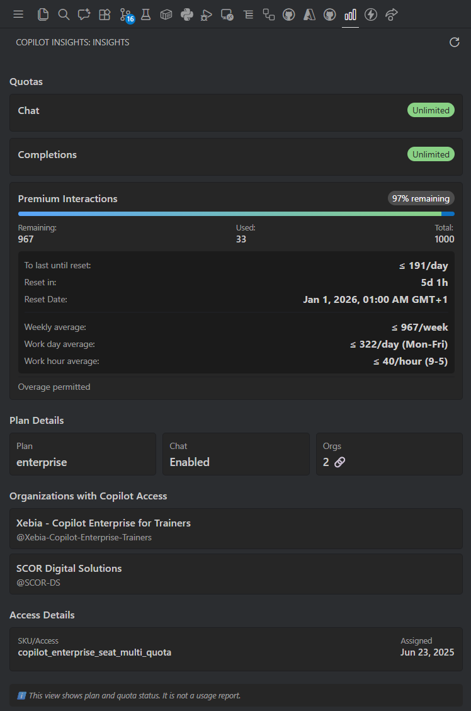

<p align="center">
	
</p>

<h1 align="center">Copilot Insights (VS Code Extension)</h1>

<p align="center">
	Understand your GitHub Copilot plan and quotas at a glance, not productivity or usage analytics — in the VS Code sidebar and status bar.
</p>

<p align="center">
	<a href="https://marketplace.visualstudio.com/items?itemName=emanuelebartolesi.vscode-copilot-insights">
		
	</a>
	<a href="https://marketplace.visualstudio.com/items?itemName=emanuelebartolesi.vscode-copilot-insights">
		
	</a>
	<a href="https://marketplace.visualstudio.com/items?itemName=emanuelebartolesi.vscode-copilot-insights">
		
	</a>
</p>

---

## What it does

Copilot Insights surfaces your GitHub Copilot entitlement/quota information and presents it in a VS Code-friendly UI:

- Sidebar view with quota cards and pacing guidance
- Status bar indicator for Premium Interactions (remaining / total + %)
- One-time warning when Premium usage exceeds 85% of your monthly quota
- Auto-refresh when the view becomes visible
- Manual refresh button in the view title bar
- Settings (gear) button in the view title bar

> Note: This view shows plan and quota status. It is not a usage report.

---

## Features

- **Weighted Prediction**: Estimates daily premium usage, with confidence level and exhaustion forecast.
- **Burn Rate Analysis**: Detects if usage is accelerating, slowing, or stable, comparing recent and average burn rates.
- **Visual Trend Chart**: Enhanced local quota history with a line chart and improved snapshot filtering.
- **Sidebar (Copilot Insights)**:
		- Shows your Copilot plan details
		- Lists organizations where you have Copilot access
		- **Local Snapshot History**: Track premium interactions over time
			- Visual line chart showing usage trends across up to 10 snapshots
			- "Since last refresh" and "Since yesterday" comparisons
			- Smart filtering to only record meaningful changes
			- All data stored locally with clear labeling
		- Displays quota cards with progress bars and pacing guidance
		- Status badges (🟢 Healthy, 🟡 Watch, 🔴 Risk) based on quota percentage
		- Optional **Quota mood** indicator (😌 / 🙂 / 😬 / 😱) to summarize quota risk at a glance
		- Micro-copy tooltips on critical fields (e.g. Unlimited, Premium interactions, Reset Date)
		- **Copy Summary to Clipboard** button for exporting insights as Markdown
		- Auto-refreshes when the view becomes visible
		- Manual refresh button in the title bar
- **Status bar indicator**:
		- Compact view of Premium Interactions remaining/total + percentage
		- **Customizable visual styles**: detailed, progress capsule, circular ring, solid bar, shaded bar, minimalist, or adaptive emoji
		- **Flexible positioning**: choose left, right, or both sides of the status bar
		- **Granular display control**: toggle name, numerical quota, and visual indicators independently
		- Severity icons and status badges based on remaining percentage
		- Tooltip with status label and reset information
		- Shows a warning notification once per reset cycle when usage passes 85%

## Screenshots

### Sidebar (Copilot Insights)



### Sidebar: “Insights” view

Open the **Copilot Insights** icon in the Activity Bar.

**Quotas (top section)**
- Shows each quota (e.g. Premium Interactions, Chat, Completions)
- Handles **Unlimited** quotas correctly
- Progress bar + remaining/used/total for limited quotas
- Status indicator: 🟢 Healthy (>50%), 🟡 Watch (20-50%), 🔴 Risk (<20%)
- Pacing helpers:
	- **To last until reset**: ≤ X/day
	- **Reset in**: Xd Xh
	- **Reset Date**
	- **Projections premium requests before the reset**:
		- **Weekly average** + **workday/workhour averages**
		- **Daily Capacity by Model Cost** (0.33x / 1x / 3x)

**Plan Details**
- Plan (e.g. Enterprise)
- Chat enabled
- Orgs count

**Organizations with Copilot Access**
- Lists org name + login so you can see where Copilot is enabled for you

**Access Details**
- Access / SKU
- Assigned date

**Freshness**
- “Last fetched: …” shown at the bottom
- Warning banner if data appears stale (older than 1 hour)

### Status bar

A compact status bar item shows your Premium Interactions remaining at a glance, for example:

- `Copilot: 975/1000 (98%)`

It also adapts the icon based on remaining percentage and includes a tooltip with reset information.

---

## Export & Sharing

Use the **"Copy Summary to Clipboard"** button at the bottom of the Insights view to export your Copilot information as formatted Markdown. This makes it easy to:

- Share quota status with your team
- Document Copilot usage in reports
- Track quota trends over time
- Include in meeting notes or documentation

The exported Markdown includes:
- Plan details (plan type, chat status, access/SKU)
- All quota information with status badges
- Pacing guidance and reset information
- Organization list

---

## Getting started

1. Install the extension (Marketplace / `.vsix` / local dev)
2. Open **Copilot Insights** from the Activity Bar
3. When prompted, sign in to GitHub using VS Code authentication
4. Review your plan + quotas
5. Use the refresh icon in the view title bar if needed

Tip: Use the gear icon in the view title bar to open Copilot Insights settings.

---

## Refresh behavior

- **Automatic:** refreshes whenever the Insights view becomes visible
- **Manual:** run **Copilot Insights: Refresh** or click the refresh icon in the view title bar

## Settings

Open Settings via the gear icon in the view title bar, or search for "Copilot Insights" in VS Code Settings.

### Progress bar mode

Choose whether quota progress bars represent remaining quota (default) or used quota:

```json
"copilotInsights.progressBarMode": "remaining"
```

Valid values: `remaining`, `used`.

---

## How pacing is calculated (important)

Pacing is based on:

- `remaining` (from the quota snapshot)
- The time between:
	- the latest snapshot `timestamp_utc` (as-of)
	- `quota_reset_date_utc` (reset)

All displayed pacing values use `floor(...)` (rounded down) so they remain conservative.

### Daily average (all days)

- `allowedPerDay = floor(remaining / daysUntilReset)`

### Weekly average (minimum 1 week)

To avoid misleading weekly values when less than one week remains:

- `weeksRemaining = max(1, floor(daysUntilReset / 7))`
- `allowedPerWeek = floor(remaining / weeksRemaining)`

### Workday / workhour averages (Mon–Fri, 9–5)

Workdays are approximated proportionally:

- `workingDays ≈ floor(daysUntilReset * 5/7)`
- `allowedPerWorkDay = floor(remaining / workingDays)` (if `workingDays > 0`)

Working hours assume 8 hours/day (9:00–17:00):

- `totalWorkingHours = workingDays * 8`
- `allowedPerHour = floor(remaining / totalWorkingHours)` (if `totalWorkingHours > 0`)

> These workday/workhour numbers are approximations (they don’t iterate real calendar weekdays).

### Premium model multipliers (0.33x / 1x / 3x)

Some premium models can “cost” more (or less) per request. The **Daily Capacity by Model Cost** section provides a quick estimate of how many requests/day you can afford at common multipliers:

- `0.33x`: `floor(remaining / 0.33 / daysUntilReset)`
- `1x`: `floor(remaining / daysUntilReset)`
- `3x`: `floor(remaining / 3 / daysUntilReset)`

---

## Data source & permissions

Copilot Insights uses VS Code’s built-in GitHub authentication and calls:

- `https://api.github.com/copilot_internal/user`

Authentication is handled via VS Code’s GitHub auth provider.

---

## Troubleshooting

### “No quota data available”

- Verify you’re signed into the correct GitHub account in VS Code
- Ensure your account has Copilot enabled
- Use the refresh command/icon

### GitHub API errors (403/404)

- Your account/tenant may not have access to this endpoint
- The endpoint may change (it is internal)

---

## Development

```sh
npm install
npm run watch
```

Press **F5** in VS Code to start an Extension Development Host.

---

## License

Add your preferred license (MIT, Apache-2.0, etc.).
