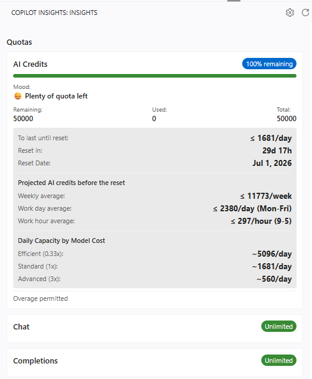
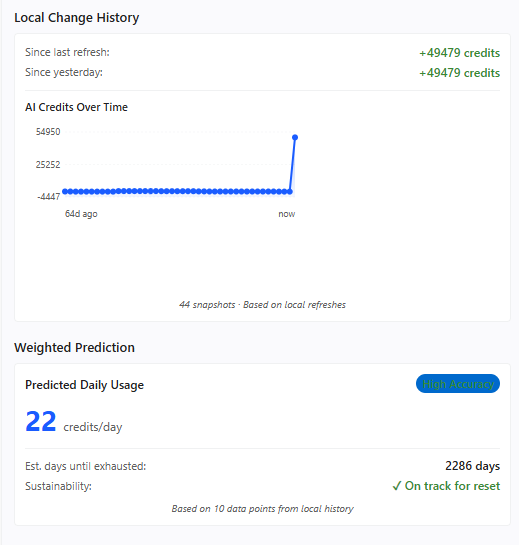
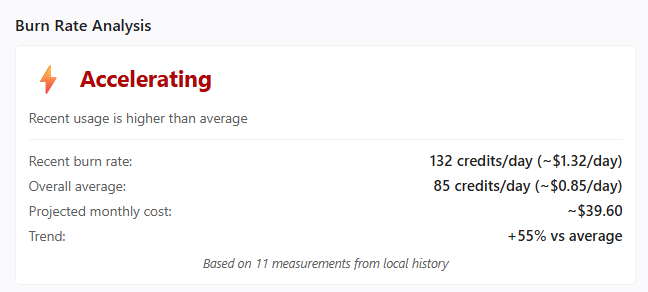

<p align="center">
  
</p>

<h1 align="center">Copilot Insights</h1>

<p align="center">
  See your GitHub Copilot plan, quotas, reset window, and AI credit usage trends directly inside VS Code.
</p>

## Overview

Copilot Insights gives you a fast, local view of the quota and entitlement data already associated with your GitHub Copilot account.

It focuses on operational visibility, not team analytics. The extension helps answer practical questions such as:

- How many AI credits do I have left?
- When does it reset?
- Am I burning through quota faster than expected?
- Do I have overage enabled?
- Which organizations are providing my Copilot access?

## Highlights

- Sidebar view with plan details, quota cards, pacing guidance, overage messaging, and organization access.
- Sprint burn-down chart that plots your actual AI credit usage against an ideal pace line for the current billing period, using locally stored snapshots.
- Weighted prediction and burn-rate analysis for AI credits.
- Status bar indicator with configurable placement, style, and content.
- One-click export to clipboard as Markdown or raw JSON.
- Configurable background polling, plus auto-refresh when the Insights view becomes visible.
- Fractional precision for AI credit usage values and percentages so displayed numbers better match Copilot reporting.

## Screenshots

### Sidebar



### Additional view





## What You Get

### Sidebar view

The Copilot Insights activity bar view shows:

- Plan summary, chat availability, and organization count.
- Quotas for Copilot features, including correct handling for unlimited quotas.
- Remaining, used, total, and percentage information for limited quotas.
- Health badges or mood indicators based on remaining AI credits.
- Reset timing and pacing guidance to help spread usage across the billing window.
- Overage state, over-quota summary, and estimated overage cost when applicable.
- Local snapshot history with trend chart and delta comparisons.
- Weighted prediction and burn-rate analysis for AI credits.
- Troubleshooting context when the endpoint fails or returns stale data.

### Status bar

The status bar provides a compact AI credit summary that can be shown on the left, right, or both sides.

Available styles:

- detailed-original
- progress-capsule
- circular-ring
- solid-bar
- shaded-bar
- minimalist
- adaptive-emoji

You can independently control whether the label, numeric quota, and visual indicator are shown.

### Clipboard export

From the webview you can copy:

- A Markdown summary for sharing in docs, issues, or chat.
- The raw Copilot payload as formatted JSON.

## Installation

Install from the Visual Studio Marketplace:

- https://marketplace.visualstudio.com/items?itemName=emanuelebartolesi.vscode-copilot-insights

You can also package and install locally from a VSIX during development.

## Getting Started

1. Install the extension.
2. Open the Copilot Insights icon in the VS Code activity bar.
3. Sign in with GitHub if VS Code prompts for authentication.
4. Review your plan details, quotas, and reset timing.
5. Leave background polling enabled for automatic updates, or use the refresh button whenever you want an immediate snapshot.

## Commands

- Copilot Insights: Refresh
- Copilot Insights: Open Settings
- Copilot Insights: Reset to Defaults
- Copilot Insights: Choose Status Bar Style (with live preview)
- Copilot Insights: Export Snapshot History (JSON or CSV)
- Copilot Insights: Clear Snapshot History
- Copilot Insights: Show Logs

## Copilot Chat integration

Ask Copilot Chat about your quota — reference the `#copilotQuota` tool in your prompt (or just ask "how many AI credits do I have left?" in agent mode) and it will answer using your live quota data.

## Configuration

Search for "Copilot Insights" in VS Code Settings or use the settings button in the view title bar.

Key settings:

- `copilotInsights.showMood`: Show a mood indicator instead of the standard health status.
- `copilotInsights.progressBarMode`: Choose `remaining` or `used` for quota bars.
- `copilotInsights.pollingIntervalSeconds`: Refresh Copilot quota data automatically every `N` seconds. Set to `0` to disable polling.
- `copilotInsights.statusBarLocation`: Choose `left`, `right`, or `both`.
- `copilotInsights.statusBarStyle`: Select the status bar visual style.
- `copilotInsights.statusBar.showName`: Toggle the `Copilot:` label.
- `copilotInsights.statusBar.showNumericalQuota`: Toggle `remaining/total` display.
- `copilotInsights.statusBar.showVisualIndicator`: Toggle the bar, ring, emoji, or similar style element.
- `copilotInsights.statusBar.enableColoredBackground`: Turn the status bar red when over quota / yellow below 20% remaining.
- `copilotInsights.customCreditLimit`: Budget against a custom AI credit limit above your plan entitlement.
- `copilotInsights.alertThresholds`: Usage percentages that trigger a warning notification (default `[85]`), each once per billing period.
- `copilotInsights.dailyBudget`: Optional daily AI credit budget shown against today's usage.

Example:

```json
{
  "copilotInsights.pollingIntervalSeconds": 60,
  "copilotInsights.progressBarMode": "remaining",
  "copilotInsights.statusBarLocation": "right",
  "copilotInsights.statusBarStyle": "detailed-original"
}
```

## How Pacing Works

Pacing guidance is based on the latest quota snapshot and the time remaining until the quota reset date.

The extension calculates:

- Daily average to stay within quota until reset.
- Weekly average.
- Approximate workday and work-hour averages.
- Daily capacity estimates for common AI model cost multipliers: `0.33x`, `1x`, and `3x`.

These values are intentionally conservative and designed for quick decision-making rather than formal forecasting.

## Data, Privacy, and Storage

Copilot Insights uses VS Code's built-in GitHub authentication provider and requests Copilot account data from:

- `https://api.github.com/copilot_internal/user`

For GitHub Enterprise, configure:

- `copilotInsights.authProvider`: set to `github-enterprise` (or keep `auto`)
- `copilotInsights.apiBaseUrl`: your enterprise API base URL (for example `https://ghe.example.com/api/v3`)

The extension appends `/copilot_internal/user` to the configured API base URL.

The extension stores a small local history of recent AI credit snapshots in VS Code global state so it can show trend and prediction views. No external service is used by this extension to store your quota history.

## Troubleshooting

### No data is shown

- Make sure you are signed into the correct GitHub account in VS Code.
- Confirm your account has GitHub Copilot access.
- Trigger a manual refresh from the view title bar or command palette.
- For GitHub Enterprise, set `copilotInsights.authProvider` to `github-enterprise` and configure `copilotInsights.apiBaseUrl`.

### GitHub API returns 403 or 404

- The account, org, or tenant may not expose this Copilot endpoint.
- The endpoint is internal and may change over time.

### Numbers look slightly different from older versions

- Recent versions preserve fractional precision for AI credit values and percentages instead of rounding everything to whole numbers.

## Development

Requirements:

- VS Code 1.107 or newer
- Node.js compatible with the repo's toolchain

Run locally:

```sh
npm install
npm run watch
```

Then press `F5` in VS Code to launch an Extension Development Host.

Useful scripts:

- `npm run compile` — typecheck, lint, and bundle (esbuild → `dist/`)
- `npm run watch` — rebuild the bundle on change
- `npm test` — run the test suite in a VS Code test host
- `npm run package` — production bundle
- `npm run test-vsix` — package and install the VSIX locally

## License

MIT. See [LICENSE](LICENSE).
