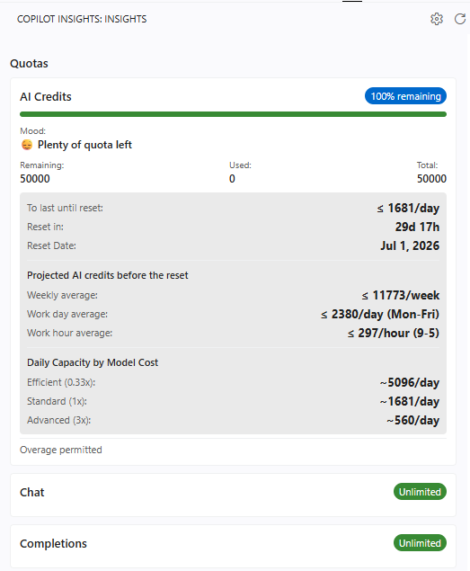
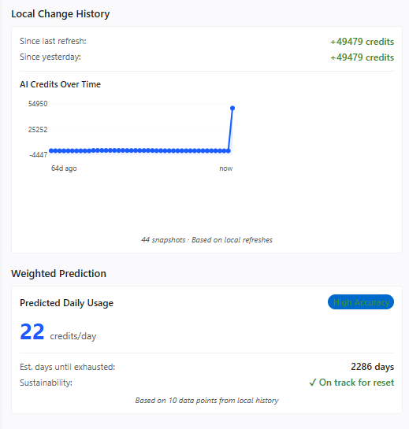
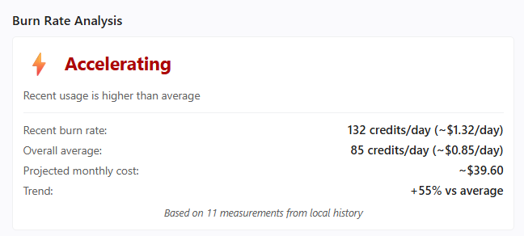

<p align="center">
  
</p>

<h1 align="center">Copilot Insights</h1>

<p align="center">
  See your GitHub Copilot plan, quotas, reset window, and AI credit usage trends directly inside VS Code.
</p>

## Overview

Copilot Insights gives you a fast, local view of the quota and entitlement data already associated with your GitHub Copilot account.

It focuses on operational visibility, not team analytics. The extension helps answer practical questions such as:

- How many AI credits do I have left?
- What did I spend them on?
- When does it reset?
- Am I burning through quota faster than expected?
- Is this month heavier than the last one?
- Do I have overage enabled?
- Which organizations are providing my Copilot access?

## Highlights

- Sidebar view with plan details, quota cards, pacing guidance, overage messaging, and organization access.
- Sprint burn-down chart that plots your actual AI credit usage against an ideal pace line for the current billing period.
- Billing period comparison: this period's total, daily average, and busiest day, measured against the period before it.
- Per-project credit attribution: which projects and branches this period's usage went to, estimated locally.
- Durable local usage history — one rollup per day, kept for months — so charts and forecasts cover the whole billing period.
- Weighted prediction and burn-rate analysis for AI credits.
- Status bar indicator with configurable placement, style, and content.
- One-click export to clipboard as Markdown or raw JSON.
- Configurable background polling, plus auto-refresh when the Insights view becomes visible.
- Fractional precision for AI credit usage values and percentages so displayed numbers better match Copilot reporting.

## Screenshots

### Sidebar



### Additional view





## What You Get

### Sidebar view

The Copilot Insights activity bar view shows:

- Plan summary, chat availability, and organization count.
- Quotas for Copilot features, including correct handling for unlimited quotas.
- Remaining, used, total, and percentage information for limited quotas.
- Health badges or mood indicators based on remaining AI credits.
- Reset timing and pacing guidance to help spread usage across the billing window.
- Overage state, over-quota summary, and estimated overage cost when applicable.
- Local usage history with trend chart and delta comparisons.
- Billing period totals compared against the previous period, plus an archive of completed periods.
- A per-project breakdown of where this period's credits went, with the part that could not be attributed shown rather than hidden.
- Weighted prediction and burn-rate analysis for AI credits.
- Troubleshooting context when the endpoint fails or returns stale data.

### Status bar

The status bar provides a compact AI credit summary that can be shown on the left, right, or both sides.

Available styles:

- detailed-original
- progress-capsule
- circular-ring
- solid-bar
- shaded-bar
- minimalist
- adaptive-emoji

You can independently control whether the label, numeric quota, and visual indicator are shown.

### Clipboard export

From the webview you can copy:

- A Markdown summary for sharing in docs, issues, or chat.
- The raw Copilot payload as formatted JSON.

## Installation

Install from the Visual Studio Marketplace:

- https://marketplace.visualstudio.com/items?itemName=emanuelebartolesi.vscode-copilot-insights

You can also package and install locally from a VSIX during development.

## Getting Started

1. Install the extension.
2. Open the Copilot Insights icon in the VS Code activity bar.
3. Sign in with GitHub if VS Code prompts for authentication.
4. Review your plan details, quotas, and reset timing.
5. Leave background polling enabled for automatic updates, or use the refresh button whenever you want an immediate snapshot.

## Commands

- Copilot Insights: Refresh
- Copilot Insights: Open Settings
- Copilot Insights: Reset to Defaults
- Copilot Insights: Choose Status Bar Style (with live preview)
- Copilot Insights: Show Organization Metrics (opt-in, requires `copilotInsights.organization`)
- Copilot Insights: Export Usage History (daily usage, project attribution, billing periods, or raw snapshots — JSON or CSV)
- Copilot Insights: Clear Usage History
- Copilot Insights: Show Logs

## Copilot Chat integration

Ask Copilot Chat about your quota — reference the `#copilotQuota` tool in your prompt (or just ask "how many AI credits do I have left?" in agent mode) and it will answer using your live quota data.

You can also chat with the `@insights` participant directly:

- `@insights /quota` — your current plan and AI credit quota.
- `@insights /pacing` — how your usage compares to the pace needed to last until reset.
- `@insights /forecast` — a projection of when your credits will run out.
- `@insights /projects` — which projects your credits went to this period.

## Configuration

Search for "Copilot Insights" in VS Code Settings or use the settings button in the view title bar.

Key settings:

- `copilotInsights.showMood`: Show a mood indicator instead of the standard health status.
- `copilotInsights.progressBarMode`: Choose `remaining` or `used` for quota bars.
- `copilotInsights.pollingIntervalSeconds`: Refresh Copilot quota data automatically every `N` seconds. Set to `0` to disable polling.
- `copilotInsights.statusBarLocation`: Choose `left`, `right`, or `both`.
- `copilotInsights.statusBarStyle`: Select the status bar visual style.
- `copilotInsights.statusBar.showName`: Toggle the `Copilot:` label.
- `copilotInsights.statusBar.showNumericalQuota`: Toggle `remaining/total` display.
- `copilotInsights.statusBar.showVisualIndicator`: Toggle the bar, ring, emoji, or similar style element.
- `copilotInsights.statusBar.enableColoredBackground`: Turn the status bar red when over quota / yellow below 20% remaining.
- `copilotInsights.customCreditLimit`: Budget against a custom AI credit limit above your plan entitlement.
- `copilotInsights.alertThresholds`: Usage percentages that trigger a warning notification (default `[85]`), each once per billing period.
- `copilotInsights.dailyBudget`: Optional daily AI credit budget shown against today's usage.
- `copilotInsights.notifyOnReset`: Show a notification when your billing period rolls over and the quota resets.
- `copilotInsights.autoExport.enabled` / `copilotInsights.autoExport.folder` / `copilotInsights.autoExport.format`: Automatically export the local usage history once per day, as `copilot-insights-history.*` (raw snapshots) and `copilot-insights-daily.*` (daily usage).
- `copilotInsights.attribution.mode`: Record which project your credits are spent on — `project-and-branch` (default), `project` to skip branch names, or `off` (which also deletes what was already recorded).
- `copilotInsights.organization`: GitHub organization slug for the opt-in organization Copilot metrics command.

Example:

```json
{
  "copilotInsights.pollingIntervalSeconds": 60,
  "copilotInsights.progressBarMode": "remaining",
  "copilotInsights.statusBarLocation": "right",
  "copilotInsights.statusBarStyle": "detailed-original"
}
```

## How Credit Attribution Works

GitHub reports how many AI credits are left, never what spent them. Attribution is therefore inferred locally from timing: when the balance drops while one project has been in the foreground of this window for the whole interval, that project is credited.

Two rules keep the estimate honest:

- **A drop is only attributed when the window stayed focused across the entire interval.** Anything else — another VS Code window, VS Code in the background, the Copilot CLI, github.com — is left out rather than guessed at. It appears as **Unattributed**.
- **Only attributed credits are stored.** The unattributed remainder is derived from the period total at display time, so a second VS Code window observing the same usage cannot inflate the totals, and the parts always add up to the whole.

The project is the workspace folder holding the active editor (or the first folder open); the branch comes from the built-in Git extension, and is omitted when that extension is unavailable.

### What it can't do

It is an estimate, not an audit trail:

- A background agent working on one project while you have another in the foreground is credited to the wrong one.
- Usage outside the editor lands in Unattributed, which is honest but not informative.
- A short session that starts and ends between two polls may be attributed to whatever was in the foreground at the next poll.

Set `copilotInsights.attribution.mode` to `project` to skip branch names, or `off` to stop recording and delete what was already recorded. Nothing is ever sent off your machine.

## How Billing Period Tracking Works

The extension records which billing period each refresh belongs to, using the quota reset date reported by GitHub. When that date rolls over, the period that just ended is summarized (total used, busiest day, days tracked, overage) and archived locally, and a new period starts.

Archived periods never overlap: a period closes at the end of the previous local day and the new one starts on the rollover day, so usage recorded earlier on the rollover day counts toward the new period.

## How Pacing Works

Pacing guidance is based on the latest quota snapshot and the time remaining until the quota reset date.

The extension calculates:

- Daily average to stay within quota until reset.
- Weekly average.
- Approximate workday and work-hour averages.
- Daily capacity estimates for common AI model cost multipliers: `0.33x`, `1x`, and `3x`.

These values are intentionally conservative and designed for quick decision-making rather than formal forecasting.

## Data, Privacy, and Storage

Copilot Insights uses VS Code's built-in GitHub authentication provider and requests Copilot account data from:

- `https://api.github.com/copilot_internal/user`

The extension stores usage history in VS Code global state, in two tiers:

- **Raw snapshots** — one per observed balance change, kept for about 48 hours (with a floor so light users keep a usable series). These drive short-range views like "since last refresh".
- **Daily rollups** — one aggregated record per calendar day, kept for roughly 13 months, plus a summary of each completed billing period. These drive the burn-down, heatmap, forecasts, and the period comparison.
- **Attribution buckets** — credits per project and branch for the current billing period, with project totals carried onto each archived period summary. Only workspace folder names and branch names are recorded, never file paths or contents.

Everything is keyed per GitHub account and stays on your machine. No external service is used by this extension to store your quota history.

### Why two tiers

Raw snapshots accumulate at the polling rate, so a heavy Copilot day can produce hundreds of them. Capping them by count alone meant the people who use Copilot most retained the least history — and the forecasting code, which needs observations spaced hours apart, was left with almost nothing to work with. Rollups keep the whole billing period at a bounded size regardless of how hard Copilot is used.

## Troubleshooting

### No data is shown

- Make sure you are signed into the correct GitHub account in VS Code.
- Confirm your account has GitHub Copilot access.
- Trigger a manual refresh from the view title bar or command palette.

### GitHub API returns 403 or 404

- The account, org, or tenant may not expose this Copilot endpoint.
- The endpoint is internal and may change over time.

### Numbers look slightly different from older versions

- Recent versions preserve fractional precision for AI credit values and percentages instead of rounding everything to whole numbers.

### Most of my usage shows as "Unattributed"

- Attribution only credits a project when this window stayed focused for the whole interval between two refreshes. Usage from another VS Code window, from the Copilot CLI, or from github.com is deliberately not guessed at.
- It also starts empty after every quota reset and after an upgrade, since past usage cannot be attributed retroactively.

### The Billing Periods comparison is empty

- The comparison needs a completed period to measure against, and the Copilot API only ever reports the period in progress. It appears after the extension observes your first quota reset.
- The current period is labeled "partial" when tracking began after it had already started.

## Development

Requirements:

- VS Code 1.107 or newer
- Node.js compatible with the repo's toolchain

Run locally:

```sh
npm install
npm run watch
```

Then press `F5` in VS Code to launch an Extension Development Host.

Useful scripts:

- `npm run compile` — typecheck, lint, and bundle (esbuild → `dist/`)
- `npm run watch` — rebuild the bundle on change
- `npm test` — run the test suite in a VS Code test host
- `npm run package` — production bundle
- `npm run test-vsix` — package and install the VSIX locally

## License

MIT. See [LICENSE](LICENSE).
